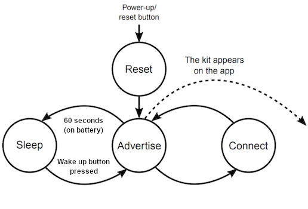
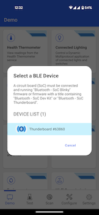
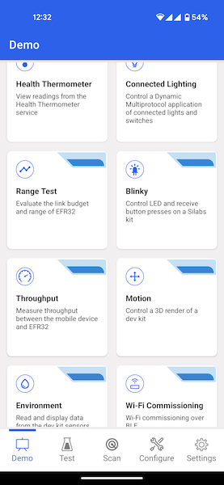
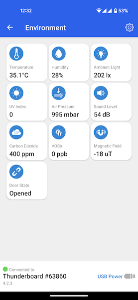
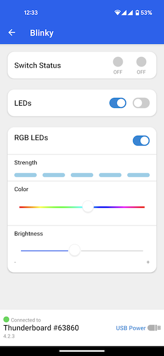
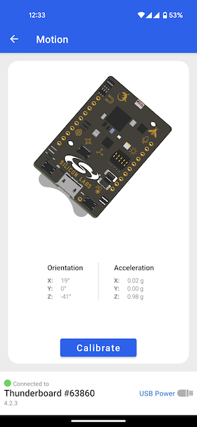

# SoC - Thunderboard / DevKit

This example collects and processes sensor data from a Thunderboard or DevKit board and gives immediate graphical feedback through the Simplicity Connect iOS/Android application.

> Note: not all Thunderboards and DevKits have the full sensor set available. The app will only show the available sensors.

> Note: this example expects a specific Gecko Bootloader to be present on your Thunderboard / DevKit device. For details see the Troubleshooting section.

## Getting Started

To get started with Silicon Labs Bluetooth and Simplicity Studio, see [QSG169: Bluetooth® Quick-Start Guide for SDK v3.x and Higher](https://www.silabs.com/documents/public/quick-start-guides/qsg169-bluetooth-sdk-v3x-quick-start-guide.pdf).

To run this example, you need either a Thunderboard or a DevKit board, a mobile device, and the Simplicity Connect mobile application, available for [iOS](https://apps.apple.com/us/app/id1030932759) and [Android](https://play.google.com/store/apps/details?id=com.siliconlabs.bledemo).

### Project Setup

The available sensors are different based on the board you use. For a list of the available features, see the User's Guide for the respective board.

After flashing the demo, the board starts to advertise. If the board is powered by battery, it goes into deep sleep mode (Energy Mode 4) after 60 seconds. It wakes up when the push button BTN0 or BTN1 is pressed. To check which button is capable of sending the EM4 Wake-Up signal, see the User's Guide of the board.

The state diagram of the firmware is shown below.

 

There are a number of tiles available in the Simplicity Connect app under the Demo tab. Select a demo by tapping it, then connect to a Thunderboard or DevKit board.

By selecting the *Environment* tile you can see the values of the different sensors mounted on the board, as shown below:

 

Within the *Blinky* tile you can control the LEDs on the board and see the state of the push buttons:

Inside the *Motion* tile, you will see a 3D image of the board. Note, that the orientation changes when you move the board, as shown below:

## Project Structure

The project code is the same for all Thunderboard / DevKit boards. The different sensor configurations are set in the automatically-generated *sl_component_catalog.h*. The main application file, *app.c*, configures the project accordingly.

The Bluetooth-related event handling is implemented in the function `sl_bt_on_event`.

The projects contain the needed services in the GATT database. GATT definitions can be extended using the GATT Configurator, which can be found under the Configuration Tools tab. To learn how to use the GATT Configurator, see [UG438: GATT Configurator User’s Guide for Bluetooth SDK v3.x](https://www.silabs.com/documents/public/user-guides/ug438-gatt-configurator-users-guide-sdk-v3x.pdf).

The sensors and I/O are also handled in this file by overriding the default weak implementation of the service handling functions.

Additional functionality can be added to the empty sl_app_process_action function.

## Troubleshooting

### Bootloader Issues

Note that Example Projects do not include a bootloader. However, Bluetooth-based Example Projects expect a bootloader to be present on the device in order to support device firmware upgrade (DFU). To get your application to work, you should either
- flash the proper bootloader or
- remove the DFU functionality from the project.

**If you do not wish to add a bootloader**, then remove the DFU functionality by uninstalling the *Bootloader Application Interface* software component -- and all of its dependants. This will automatically put your application code to the start address of the flash, which means that a bootloader is no longer needed, but also that you will not be able to upgrade your firmware.

**If you want to add a bootloader**, then either
- Create a bootloader project, build it and flash it to your device. Note that different projects expect different bootloaders:
  - for NCP and RCP projects create a *BGAPI UART DFU* type bootloader
  - for SoC projects on Series 2 devices create a *Bluetooth Apploader OTA DFU* type bootloader

- or run a precompiled Demo on your device from the Launcher view before flashing your application. Precompiled demos flash both bootloader and application images to the device. Flashing your own application image after the demo will overwrite the demo application but leave the bootloader in place.
  - For NCP and RCP projects, flash the *Bluetooth - NCP* demo.
  - For SoC projects, flash the *Bluetooth - SoC Thermometer* demo.

**Important Notes:**
- when you flash your application image to the device, use the *.hex* or *.s37* output file. Flashing *.bin* files may overwrite (erase) the bootloader.

- On Series 2 devices SoC example projects require a *Bluetooth Apploader OTA DFU* type bootloader by default. This bootloader needs a lot of flash space and does not fit into the regular bootloader area, hence the application start address must be shifted. This shift is automatically done by the *Apploader Support for Applications* software component, which is installed by default. If you want to use any other bootloader type, you should remove this software component in order to shift the application start address back to the end of the regular bootloader area. Note, that in this case you cannot do OTA DFU with Apploader, but you can still implement application-level OTA DFU by installing the *Application OTA DFU* software component instead of *In-place OTA DFU*.

For more information on bootloaders, see [UG103.6: Bootloader Fundamentals](https://www.silabs.com/documents/public/user-guides/ug103-06-fundamentals-bootloading.pdf) and [UG489: Silicon Labs Gecko Bootloader User's Guide for GSDK 4.0 and Higher](https://cn.silabs.com/documents/public/user-guides/ug489-gecko-bootloader-user-guide-gsdk-4.pdf).

Note: This Thunderboard / DevKit example needs the *bootloader-apploader* type of bootloader to be installed to work out of the box.

## Resources

[Bluetooth Documentation](https://docs.silabs.com/bluetooth/latest/)

[UG103.14: Bluetooth LE Fundamentals](https://www.silabs.com/documents/public/user-guides/ug103-14-fundamentals-ble.pdf)

[QSG169: Bluetooth SDK v3.x Quick Start Guide](https://www.silabs.com/documents/public/quick-start-guides/qsg169-bluetooth-sdk-v3x-quick-start-guide.pdf)

[UG434: Silicon Labs Bluetooth® C Application Developer's Guide for SDK v3.x](https://www.silabs.com/documents/public/user-guides/ug434-bluetooth-c-soc-dev-guide-sdk-v3x.pdf)

[Bluetooth Training](https://www.silabs.com/support/training/bluetooth)

## Report Bugs & Get Support

You are always encouraged and welcome to report any issues you found to us via [Silicon Labs Community](https://www.silabs.com/community).
